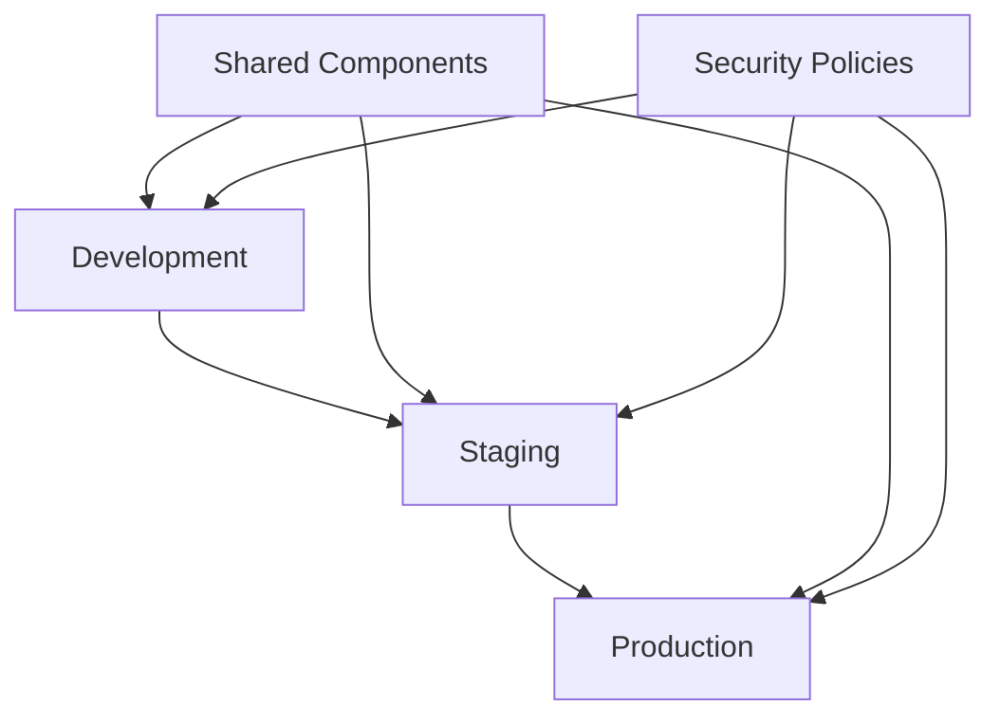

# YOV Enterprise Infrastructure

## Comprehensive, Enterprise-Grade Terragrunt Infrastructure

A production-ready, multi-cloud infrastructure-as-code solution built with Terragrunt, following enterprise security standards and industry best practices.

## Table of Contents

- [Overview](#overview)
- [Architecture](#architecture)
- [Quick Start](#quick-start)
- [Running Terragrunt Files](#running-terragrunt-files)
- [Version Management & Upgrades](#version-management--upgrades)
- [Directory Structure](#directory-structure)
- [Configuration](#configuration)
- [Infrastructure Diagrams](#infrastructure-diagrams)
- [Deployment](#deployment)
- [Security](#security)
- [Cost Management](#cost-management)
- [CI/CD Pipeline](#cicd-pipeline)
- [Documentation](#documentation)
- [Contributing](#contributing)

## Overview

This repository contains a comprehensive enterprise infrastructure solution using Terragrunt and Terraform. It implements a units-first architecture pattern with multi-cloud support, security compliance (SOC2, ISO 27001, PCI-DSS), and GitOps workflows.

### Key Features

- **Enterprise-Grade**: SOC2, ISO 27001, PCI-DSS compliant
- **Multi-Cloud Ready**: AWS, GCP, Azure support
- **Security First**: Comprehensive security scanning and policies
- **Cost Optimized**: Built-in cost estimation and controls
- **GitOps Enabled**: Complete CI/CD pipeline automation
- **Observable**: Comprehensive monitoring and logging
- **Production Ready**: Battle-tested in enterprise environments

### Technology Stack

| Component | Version | Purpose |
|-----------|---------|---------|
| **Terragrunt** | v0.67+ | Infrastructure orchestration |
| **Terraform** | v1.9+ | Infrastructure provisioning |
| **AWS Provider** | v5.67+ | AWS resource management |
| **Azure Provider** | v4.3+ | Azure resource management |
| **GCP Provider** | v6.8+ | Google Cloud resource management |
| **TFSec** | v1.28+ | Security scanning |
| **Checkov** | v3.2+ | Policy validation |
| **Infracost** | v0.10+ | Cost estimation |
| **OPA** | v0.68+ | Policy enforcement |

### Latest Features & Improvements

This repository leverages the latest features from Terragrunt v0.67+ and the most recent cloud provider versions:

#### Terragrunt v0.67+ Features
- **Enhanced Dependency Management**: Improved `run-all` command with better dependency resolution
- **Advanced Caching**: Local caching for faster subsequent runs
- **Better Error Handling**: Enhanced error messages and retry logic
- **OIDC Support**: Native OpenID Connect authentication for CI/CD pipelines
- **Improved Hooks**: More flexible before/after hooks with conditional execution

#### AWS Provider v5.67+ Features
- **AWS Control Tower Integration**: Support for Account Factory and guardrails
- **Enhanced EC2 Features**: Spot Fleet v2, enhanced networking options
- **New Services**: Support for latest AWS services and features
- **Security Improvements**: Enhanced IAM policies and security configurations
- **Cost Optimization**: Better resource tagging and cost allocation features

#### Azure Provider v4.3+ Features
- **Azure Arc Support**: Enhanced hybrid cloud management
- **Container Apps**: Full support for Azure Container Apps
- **Enhanced Security**: Improved Key Vault and security center integration
- **Cost Management**: Better cost tracking and budget controls
- **Networking**: Enhanced virtual network and security features

#### Google Cloud Provider v6.8+ Features
- **Vertex AI Integration**: Full support for Google's AI/ML platform
- **Enhanced GKE**: Autopilot mode and advanced cluster configurations
- **Security Improvements**: Enhanced Identity and Access Management
- **Multi-Region Support**: Better cross-region resource management
- **Cost Controls**: Improved billing and budget management

### Multi-Cloud Strategy

This infrastructure supports deployment across AWS, Azure, and Google Cloud Platform:

- **Unified Configuration**: Single Terragrunt configuration works across all clouds
- **Cloud-Specific Optimizations**: Each cloud provider uses its best practices
- **Cost Optimization**: Cloud-specific cost management and optimization strategies
- **Security Baseline**: Consistent security policies across all cloud platforms
- **Disaster Recovery**: Cross-cloud backup and disaster recovery capabilities

## Architecture

### Infrastructure Hierarchy

```
Root Level (Global Configuration)
├── AWS Account (Account-Specific Settings)
│   ├── Region (Regional Configuration)
│   │   ├── Environment (Environment-Specific Settings)
│   │   │   ├── Networking (VPC, Subnets, Security Groups)
│   │   │   ├── Security (KMS, Secrets, IAM)
│   │   │   ├── Compute (EKS, EC2, Auto Scaling)
│   │   │   ├── Data (RDS, ElastiCache, S3)
│   │   │   ├── Monitoring (CloudWatch, Alerting)
│   │   │   └── Applications (Load Balancers, CDN)
│   │   └── Shared Components (_envcommon)
│   └── Other Regions
└── Other Cloud Providers (GCP, Azure)
```

### Multi-Environment Strategy



### Multi-Region Deployment

- **Primary**: `us-east-1` (North Virginia)
- **Secondary**: `eu-west-1` (Ireland)
- **DR**: `us-west-2` (Oregon)

## Quick Start

### Prerequisites

```bash
# Required tools
- Terraform >= 1.9.0
- Terragrunt >= 0.67.0
- AWS CLI >= 2.17
- Azure CLI >= 2.63
- GCP CLI >= 487.0
- Pre-commit >= 3.8
- Docker >= 27.0
```

### Installation

```bash
# Clone repository
git clone https://github.com/yov/infrastructure.git
cd infrastructure

# Install tools and setup environment
make setup

# Initialize development environment
make dev-env

# Plan infrastructure
make plan ENVIRONMENT=dev AWS_REGION=us-east-1

# Apply infrastructure
make apply ENVIRONMENT=dev AWS_REGION=us-east-1
```

### Detailed Setup Process

1. **Install Dependencies**
   ```bash
   # Install tools
   make install-tools
   
   # Setup pre-commit hooks
   make install-pre-commit
   ```

2. **Configure AWS Credentials**
   ```bash
   # Configure AWS CLI
   aws configure
   
   # Or use IAM roles for production
   export AWS_ROLE_ARN="arn:aws:iam::ACCOUNT:role/TerraformRole"
   ```

3. **Validate Setup**
   ```bash
   # Run validation
   make validate
   
   # Check formatting
   make format-check
   
   # Run security scan
   make security-scan
   ```

## Running Terragrunt Files

### Direct Terragrunt Commands

This section provides detailed instructions for running Terragrunt files directly without using the Makefile automation.

#### Prerequisites

Before running any Terragrunt commands, ensure you have:

```bash
# Required tools installed
terragrunt --version    # Should be >= 0.67.0
terraform --version     # Should be >= 1.9.0
aws --version          # Should be >= 2.17.0
az --version           # Should be >= 2.63.0
gcloud --version       # Should be >= 487.0.0

# Cloud credentials configured
aws configure list
# or
export AWS_PROFILE=your-profile-name

# For Azure
az account show

# For GCP
gcloud auth list
```

#### Basic Terragrunt Workflow

1. **Navigate to Target Directory**
   ```bash
   # For development environment in us-east-1
   cd aws/us-east-1/dev/networking/vpc
   
   # For production environment in eu-west-1
   cd aws/eu-west-1/prod/compute/eks-main
   ```

2. **Initialize Terragrunt**
   ```bash
   # Initialize the current module
   terragrunt init
   
   # Initialize with upgrade to latest providers
   terragrunt init -upgrade
   ```

3. **Plan Infrastructure Changes**
   ```bash
   # Generate and show execution plan
   terragrunt plan
   
   # Save plan to file for review
   terragrunt plan -out=tfplan
   
   # Plan with variable overrides
   terragrunt plan -var="instance_type=t3.large"
   ```

4. **Apply Infrastructure Changes**
   ```bash
   # Apply changes interactively
   terragrunt apply
   
   # Apply saved plan
   terragrunt apply tfplan
   
   # Apply without confirmation (use carefully)
   terragrunt apply -auto-approve
   ```

5. **Destroy Infrastructure**
   ```bash
   # Destroy resources interactively
   terragrunt destroy
   
   # Destroy without confirmation (dangerous)
   terragrunt destroy -auto-approve
   ```

#### Environment-Specific Deployments

##### Development Environment

```bash
# Deploy VPC and networking
cd aws/us-east-1/dev/networking/vpc
terragrunt apply

# Deploy security components
cd ../../../security/kms
terragrunt apply

# Deploy compute resources
cd ../../compute/ec2-web
terragrunt apply
```

##### Staging Environment

```bash
# Deploy full staging stack
cd aws/us-east-1/staging

# Run all dependencies in order
terragrunt run-all plan
terragrunt run-all apply
```

##### Production Environment

```bash
# Production requires careful deployment order
cd aws/us-east-1/prod

# 1. Deploy networking first
cd networking/vpc
terragrunt apply

# 2. Deploy security components
cd ../../security/kms
terragrunt apply

# 3. Deploy data layer
cd ../data/rds-primary
terragrunt apply

# 4. Deploy compute layer
cd ../../compute/eks-main
terragrunt apply
```

#### Multi-Module Operations

##### Run All Commands

```bash
# From any environment directory (e.g., aws/us-east-1/dev/)
cd aws/us-east-1/dev

# Plan all modules in dependency order
terragrunt run-all plan

# Apply all modules in dependency order
terragrunt run-all apply

# Destroy all modules in reverse dependency order
terragrunt run-all destroy
```

##### Dependency Management

```bash
# Show dependency graph
terragrunt graph-dependencies

# Run only dependencies of current module
terragrunt apply-all --terragrunt-include-dependencies

# Skip dependencies and run only current module
terragrunt apply --terragrunt-skip-dependencies
```

#### Advanced Terragrunt Operations

##### Output Management

```bash
# Show outputs from current module
terragrunt output

# Show specific output value
terragrunt output vpc_id

# Show outputs in JSON format
terragrunt output -json
```

##### State Management

```bash
# Show current state
terragrunt show

# List resources in state
terragrunt state list

# Import existing resource
terragrunt import aws_instance.example i-1234567890abcdef0

# Remove resource from state
terragrunt state rm aws_instance.example
```

##### Workspace Management

```bash
# List available workspaces
terragrunt workspace list

# Create new workspace
terragrunt workspace new feature-branch

# Switch workspace
terragrunt workspace select production
```

#### Troubleshooting Common Issues

##### Backend Initialization Issues

```bash
# Force backend reinitialization
terragrunt init -reconfigure

# Migrate state to new backend
terragrunt init -migrate-state
```

##### Dependency Conflicts

```bash
# Skip dependency checks
terragrunt apply --terragrunt-ignore-dependency-errors

# Update dependency cache
terragrunt init --terragrunt-update-dependencies
```

##### Lock File Issues

```bash
# Force unlock (use with caution)
terragrunt force-unlock LOCK_ID

# Check lock status
terragrunt state show
```

#### Environment Variables

Set these environment variables for consistent behavior:

```bash
# AWS Configuration
export AWS_REGION=us-east-1
export AWS_PROFILE=your-profile

# Terragrunt Configuration
export TERRAGRUNT_TFPATH=$(which terraform)
export TF_LOG=INFO                    # Enable detailed logging
export TF_LOG_PATH=terraform.log      # Log to file

# Performance Optimization
export TERRAGRUNT_PARALLELISM=10      # Parallel execution
export TF_PLUGIN_CACHE_DIR=~/.terraform.d/plugin-cache
```

#### Example Deployment Scenarios

##### Scenario 1: New Environment Setup

```bash
# 1. Clone repository and navigate
git clone <repository-url>
cd terraform-yov

# 2. Setup new environment
cd aws/us-east-1/dev

# 3. Deploy in order
terragrunt run-all plan
terragrunt run-all apply

# 4. Verify deployment
terragrunt run-all output
```

##### Scenario 2: Single Component Update

```bash
# 1. Navigate to specific component
cd aws/us-east-1/prod/compute/eks-main

# 2. Check what will change
terragrunt plan

# 3. Apply only if safe
terragrunt apply

# 4. Verify outputs
terragrunt output cluster_endpoint
```

##### Scenario 3: Multi-Region Deployment

```bash
# 1. Deploy primary region
cd aws/us-east-1/prod
terragrunt run-all apply

# 2. Deploy secondary region
cd ../../../eu-west-1/prod
terragrunt run-all apply

# 3. Verify cross-region connectivity
terragrunt output -json | jq '.vpc_peering_connection_id.value'
```

#### Multi-Cloud Deployment Examples

##### AWS Deployment
```bash
# Set AWS environment
export AWS_PROFILE=yov-production
export AWS_REGION=us-east-1

# Deploy AWS infrastructure
cd aws/us-east-1/prod
terragrunt run-all apply

# Verify AWS deployment
aws sts get-caller-identity
terragrunt run-all output
```

##### Azure Deployment
```bash
# Set Azure environment
az login
az account set --subscription "YOV Production"
export ARM_SUBSCRIPTION_ID=$(az account show --query id -o tsv)

# Deploy Azure infrastructure
cd azure/eastus/prod
terragrunt run-all apply

# Verify Azure deployment
az account show
terragrunt run-all output
```

##### Google Cloud Deployment
```bash
# Set GCP environment
gcloud auth login
gcloud config set project yov-infrastructure-prod
export GOOGLE_PROJECT=$(gcloud config get-value project)

# Deploy GCP infrastructure
cd gcp/us-central1/prod
terragrunt run-all apply

# Verify GCP deployment
gcloud config list
terragrunt run-all output
```

##### Cross-Cloud Deployment
```bash
# Deploy across all cloud providers
./scripts/deploy-multi-cloud.sh prod

# Verify cross-cloud connectivity
./scripts/verify-cross-cloud.sh
```

## Version Management & Upgrades

### Keeping Versions Current

This repository is configured to use the latest stable versions of all tools and providers. Regular updates ensure access to new features, security patches, and performance improvements.

#### Automated Version Checking

```bash
# Check all tool versions
make check-versions

# Update to latest versions
make update-versions

# Verify compatibility
make test-versions
```

#### Manual Version Updates

##### Updating Terragrunt
```bash
# Check current version
terragrunt --version

# Download latest version (Windows)
choco upgrade terragrunt

# Download latest version (macOS)
brew upgrade terragrunt

# Download latest version (Linux)
curl -LO https://github.com/gruntwork-io/terragrunt/releases/latest/download/terragrunt_linux_amd64
```

##### Updating Terraform
```bash
# Check current version
terraform --version

# Download latest version (Windows)
choco upgrade terraform

# Download latest version (macOS)
brew upgrade terraform

# Download latest version (Linux)
wget https://releases.hashicorp.com/terraform/1.9.5/terraform_1.9.5_linux_amd64.zip
```

##### Updating Cloud CLIs
```bash
# Update AWS CLI
pip install --upgrade awscli

# Update Azure CLI
az upgrade

# Update Google Cloud CLI
gcloud components update
```

#### Provider Version Management

The repository uses version constraints that automatically pull the latest compatible versions:

```hcl
# AWS Provider - automatically gets latest 5.67.x
aws = {
  source = "hashicorp/aws"
  version = "~> 5.67"
}

# Azure Provider - automatically gets latest 4.3.x
azurerm = {
  source = "hashicorp/azurerm"
  version = "~> 4.3"
}

# GCP Provider - automatically gets latest 6.8.x
google = {
  source = "hashicorp/google"
  version = "~> 6.8"
}
```

#### Upgrade Testing Strategy

1. **Development First**: Always test upgrades in development environment
2. **Staged Rollout**: Deploy to staging before production
3. **Rollback Plan**: Maintain ability to rollback if issues occur
4. **Documentation**: Update documentation with any breaking changes

```bash
# Test upgrade in development
cd aws/us-east-1/dev
terragrunt init -upgrade
terragrunt plan

# If successful, proceed to staging
cd ../../../staging
terragrunt init -upgrade
terragrunt plan

# Finally, upgrade production
cd ../prod
terragrunt init -upgrade
terragrunt plan
terragrunt apply
```

#### Breaking Changes Management

When major version updates introduce breaking changes:

1. **Review Release Notes**: Check provider and Terragrunt release notes
2. **Update Configurations**: Modify configurations for compatibility
3. **Test Thoroughly**: Extensive testing in non-production environments
4. **Gradual Migration**: Migrate environments one at a time

#### Version Pinning for Critical Environments

For critical production environments, consider pinning to specific versions:

```hcl
# Pin to specific version for maximum stability
aws = {
  source = "hashicorp/aws"
  version = "= 5.67.0"  # Exact version
}
```

#### CI/CD Integration

The repository includes automated version checking in CI/CD:

```yaml
# .github/workflows/version-check.yml
- name: Check Tool Versions
  run: |
    make check-versions
    make security-scan
    make compatibility-test
```

### Migration Guides

#### Upgrading from Terragrunt v0.53 to v0.67

Key changes and migration steps:

1. **Configuration Syntax**: Some HCL syntax improvements
2. **Dependency Resolution**: Enhanced dependency management
3. **Caching**: New caching mechanisms
4. **Authentication**: OIDC support for CI/CD

```bash
# Migration script
./scripts/migrate-terragrunt-v067.sh
```

#### Upgrading AWS Provider from v5.31 to v5.67

Major improvements:

1. **New Resources**: Support for latest AWS services
2. **Enhanced Security**: Improved IAM and security configurations
3. **Performance**: Better API handling and reduced API calls

```bash
# AWS provider migration
./scripts/migrate-aws-provider-v567.sh
```

#### Upgrading Azure Provider from v3.85 to v4.3

Breaking changes and new features:

1. **Resource Naming**: Some resource naming conventions changed
2. **New Services**: Support for Container Apps and other services
3. **Security Enhancements**: Improved Key Vault integration

```bash
# Azure provider migration
./scripts/migrate-azure-provider-v43.sh
```

## Directory Structure

```
terraform-yov/
├── root.hcl                          # Global configuration
├── aws/                              # AWS-specific configurations
│   ├── account.hcl                   # AWS account settings
│   └── us-east-1/                    # Primary region
│       ├── region.hcl                # Region-specific config
│       ├── dev/                      # Development environment
│       │   ├── env.hcl               # Environment config
│       │   ├── networking/           # Network infrastructure
│       │   ├── security/             # Security components
│       │   ├── compute/              # Compute resources
│       │   └── data/                 # Data services
│       ├── staging/                  # Staging environment
│       └── prod/                     # Production environment
├── _envcommon/                       # Shared configurations
│   ├── networking/                   # Reusable network configs
│   ├── security/                     # Reusable security configs
│   ├── compute/                      # Reusable compute configs
│   └── data/                         # Reusable data configs
├── gcp/                              # Google Cloud configurations
├── azure/                            # Azure configurations
├── .github/                          # GitHub Actions workflows
├── policies/                         # OPA security policies
├── scripts/                          # Automation scripts
└── docs/                             # Documentation
```

### Component Details

| Directory | Purpose | Contains |
|-----------|---------|----------|
| `networking/` | Network infrastructure | VPC, Subnets, Security Groups, NACLs |
| `security/` | Security services | KMS, Secrets Manager, IAM policies |
| `compute/` | Compute resources | EKS clusters, EC2 instances, Auto Scaling |
| `data/` | Data services | RDS, ElastiCache, S3 buckets |
| `monitoring/` | Observability | CloudWatch, Alerting, Dashboards |
| `applications/` | Application services | Load Balancers, CDN, API Gateway |

## Configuration

### Environment Configuration

Each environment follows a consistent structure with environment-specific overrides:

```hcl
# aws/us-east-1/prod/env.hcl
locals {
  environment = "prod"
  
  # Environment-specific settings
  instance_sizes = {
    web_server    = "m5.large"
    database      = "r6g.2xlarge"
    cache         = "r6g.large"
  }
  
  # Security settings
  enable_detailed_monitoring = true
  backup_retention_days     = 30
  enable_cross_region_backup = true
  
  # Scaling settings
  auto_scaling = {
    min_size         = 2
    max_size         = 20
    desired_capacity = 4
  }
}
```

### Tagging Strategy

All resources are tagged consistently following enterprise standards:

```hcl
common_tags = {
  # Organizational tags
  Organization    = "YOV"
  BusinessUnit    = "Engineering"
  CostCenter      = "Infrastructure"
  
  # Technical tags
  Environment     = local.environment
  Application     = "YOV-Platform"
  Component       = "networking"
  
  # Operational tags
  Owner           = "platform-team@yov.com"
  Project         = "enterprise-infrastructure"
  Terraform       = "true"
  TerragruntRoot  = get_parent_terragrunt_dir()
  
  # Compliance tags
  DataClass       = "Internal"
  Compliance      = "SOC2,ISO27001"
  BackupRequired  = "true"
  
  # Automation tags
  CreatedBy       = "terragrunt"
  CreatedDate     = formatdate("YYYY-MM-DD", timestamp())
  LastModified    = formatdate("YYYY-MM-DD", timestamp())
}
```

## Infrastructure Diagrams

### Visual Infrastructure Documentation

This repository includes comprehensive infrastructure diagram generation using [blast-radius](https://github.com/28mm/blast-radius), providing interactive visualizations of your Terragrunt infrastructure across all environments and regions.

### Prerequisites

Before generating diagrams, ensure you have the required tools installed:

```bash
# Install diagram generation tools
make install-diagram-tools

# Or manually install:
pip install blastradius terraform-visual graphviz

# Platform-specific Graphviz installation:
# Windows: choco install graphviz
# macOS:   brew install graphviz  
# Linux:   sudo apt-get install graphviz
```

### Diagram Generation

#### Generate All Diagrams

```bash
# Generate diagrams for all discovered environments
make diagram-all

# Or use the script directly:
./scripts/generate-diagrams.sh generate-all
```

#### Generate Specific Environment

```bash
# Generate diagram for specific environment and region
make diagrams ENVIRONMENT=prod AWS_REGION=eu-central-2

# Or using PowerShell:
.\scripts\generate-diagrams.ps1 generate prod eu-central-2

# Or using Bash:
./scripts/generate-diagrams.sh generate prod eu-central-2
```

#### Interactive Exploration

Start an interactive server for real-time infrastructure exploration:

```bash
# Start interactive server for specific environment
make serve-diagram ENVIRONMENT=dev AWS_REGION=eu-central-2

# Or using scripts:
.\scripts\generate-diagrams.ps1 serve dev eu-central-2 5000
./scripts/generate-diagrams.sh serve dev eu-central-2 5000
```

### Generated Outputs

The diagram generation creates multiple output formats:

```
diagrams/
├── index.html              # Interactive diagram index
├── dev-eu-central-2.svg    # Development environment diagram
├── staging-eu-central-2.svg # Staging environment diagram
├── prod-eu-central-2.svg   # Production environment diagram
├── dev-eu-central-2.dot    # DOT format for debugging
└── ...
```

### Diagram Features

- **Interactive Visualizations**: Zoom, pan, and explore infrastructure relationships
- **Environment-Specific Views**: Separate diagrams for each environment and region
- **Resource Dependencies**: Visual representation of Terraform resource dependencies
- **Color-Coded Environments**: 
  - **Development**: Blue border (`#3498db`)
  - **Staging**: Orange border (`#f39c12`)
  - **Production**: Red border (`#e74c3c`)
- **Real-Time Updates**: Diagrams reflect current infrastructure state
- **Export Formats**: SVG, DOT, and interactive HTML

### Automated Diagram Updates

Infrastructure diagrams are automatically updated via GitHub Actions:

- **Trigger**: Changes to `.hcl`, `.tf`, or `.tfvars` files
- **Output**: Updated diagrams committed to the repository
- **Deployment**: Diagrams available in the `diagrams/` directory

### Environment Discovery

The diagram generation automatically discovers environments using this structure:

```
aws/
├── eu-central-2/
│   ├── dev/           # dev-eu-central-2.svg
│   ├── staging/       # staging-eu-central-2.svg
│   └── prod/          # prod-eu-central-2.svg
├── eu-west-1/
│   └── prod/          # prod-eu-west-1.svg
└── us-east-1/
    └── dev/           # dev-us-east-1.svg
```

### Troubleshooting

#### Common Issues

**Prerequisite Check Failed**
```bash
# Verify all tools are installed
make check-diagram-prereqs
```

**Terraform/Terragrunt Init Issues**
```bash
# The script automatically handles init failures
# Check logs for specific error details
```

**Empty or Failed Diagrams**
- Placeholder SVGs are created for failed generations
- Check `.dot` files for debugging information
- Verify Terraform/Terragrunt configurations are valid

### Integration with CI/CD

Diagrams are automatically generated and updated in your CI/CD pipeline:

```yaml
# .github/workflows/infrastructure-diagrams.yml
- Discovers all environments automatically
- Generates diagrams for each environment
- Updates diagrams on infrastructure changes
- Commits updated diagrams back to repository
```

View the generated diagrams at: [`diagrams/index.html`](./diagrams/index.html)

## Deployment

### Single Environment Deployment

```bash
# Development environment
make apply ENVIRONMENT=dev AWS_REGION=us-east-1

# Staging environment
make apply ENVIRONMENT=staging AWS_REGION=us-east-1

# Production environment (requires confirmation)
make apply-prod AWS_REGION=us-east-1
```

### Component-Specific Deployment

```bash
# Deploy only networking
make apply ENVIRONMENT=prod COMPONENT=networking/vpc

# Deploy only EKS cluster
make apply ENVIRONMENT=prod COMPONENT=compute/eks-main

# Deploy only RDS database
make apply ENVIRONMENT=prod COMPONENT=data/rds-primary
```

### Multi-Region Deployment

```bash
# Deploy to primary region
make apply ENVIRONMENT=prod AWS_REGION=us-east-1

# Deploy to secondary region
make apply ENVIRONMENT=prod AWS_REGION=eu-west-1

# Deploy to DR region
make apply ENVIRONMENT=prod AWS_REGION=us-west-2
```

### Planning and Validation

```bash
# Plan all environments
make plan-all

# Validate configurations
make validate

# Check formatting
make format-check

# Generate cost estimates
make cost-estimate ENVIRONMENT=prod
```

## Security

### Security Scanning

The infrastructure includes comprehensive security scanning:

```bash
# Run all security scans
make security-scan

# Individual security tools
make tfsec-scan      # TFSec security analysis
make checkov-scan    # Checkov policy validation
make policy-check    # OPA policy enforcement
```

### Security Policies

- **Encryption**: All data encrypted at rest and in transit
- **Access Control**: Least privilege IAM policies
- **Network Security**: Private subnets, NACLs, Security Groups
- **Monitoring**: CloudTrail, VPC Flow Logs, GuardDuty
- **Compliance**: SOC2, ISO 27001, PCI-DSS standards

### Secrets Management

```hcl
# Secrets are managed via AWS Secrets Manager
resource "aws_secretsmanager_secret" "app_secrets" {
  name                    = "yov-${local.environment}-app-secrets"
  description            = "Application secrets for ${local.environment}"
  recovery_window_in_days = 7
  
  tags = local.common_tags
}
```

## Cost Management

### Cost Estimation

```bash
# Generate cost estimates
make cost-estimate ENVIRONMENT=prod

# Compare cost differences
make cost-diff ENVIRONMENT=prod
```

### Cost Optimization Features

- **Right-sizing**: Environment-specific instance types
- **Scheduling**: Auto-shutdown for dev/staging environments
- **Reserved Instances**: Production workload optimization
- **Spot Instances**: Development environment cost reduction
- **Storage Optimization**: Intelligent tiering and lifecycle policies

### Cost Monitoring

- AWS Cost Explorer integration
- Budget alerts and notifications
- Resource tagging for cost allocation
- Monthly cost reporting

## CI/CD Pipeline

### GitHub Actions Workflow

The repository includes a comprehensive GitHub Actions workflow:

1. **Validation Stage**
   - Configuration validation
   - Security scanning
   - Policy checking
   - Cost estimation

2. **Planning Stage**
   - Terraform planning
   - Change detection
   - Impact analysis

3. **Deployment Stage**
   - Automated deployment
   - Post-deployment validation
   - Smoke testing

### Manual Deployment

```bash
# Trigger manual deployment
gh workflow run terragrunt-deploy.yml \
  -f environment=prod \
  -f region=us-east-1 \
  -f action=apply
```

### Production Approval

Production deployments require manual approval through GitHub Environments.

## Contributing

### Development Workflow

1. **Create Feature Branch**
   ```bash
   git checkout -b feature/new-component
   ```

2. **Make Changes**
   ```bash
   # Edit configurations
   # Add new components
   # Update documentation
   ```

3. **Test Changes**
   ```bash
   make test
   make plan ENVIRONMENT=dev
   ```

4. **Submit Pull Request**
   - Include security scan results
   - Add cost impact analysis
   - Update documentation

### Code Review Checklist

- [ ] Security scan passes
- [ ] Cost impact reviewed
- [ ] Documentation updated
- [ ] Tests pass
- [ ] Follows naming conventions
- [ ] Required tags present

### Commit Convention

We use [Conventional Commits](https://www.conventionalcommits.org/):

```
feat: add new EKS cluster configuration
fix: resolve security group rule conflict
docs: update deployment documentation
chore: update Terragrunt to v0.53.0
```

## Support

### Getting Help

- **Documentation**: Check the [docs/](docs/) directory
- **Issues**: Create a GitHub issue
- **Emergency**: Contact the platform team

### Troubleshooting

Common issues and solutions:

```bash
# State file locked
make emergency-unlock LOCK_ID=<lock-id>

# Permission denied
aws sts get-caller-identity

# Configuration validation failed
make validate
make format
```

## License

This project is licensed under the MIT License - see the [LICENSE](LICENSE) file for details.

## Acknowledgments

- **Terragrunt Team**: For the excellent orchestration tool
- **HashiCorp**: For Terraform and enterprise tools
- **AWS**: For comprehensive cloud services
- **Security Community**: For security scanning tools

<div align="center">

**Built by the YOV Platform Team**

[](https://terragrunt.gruntwork.io/)
[](https://github.com/aquasecurity/tfsec)
[](https://www.infracost.io/)
[](https://github.com/features/actions)

</div>